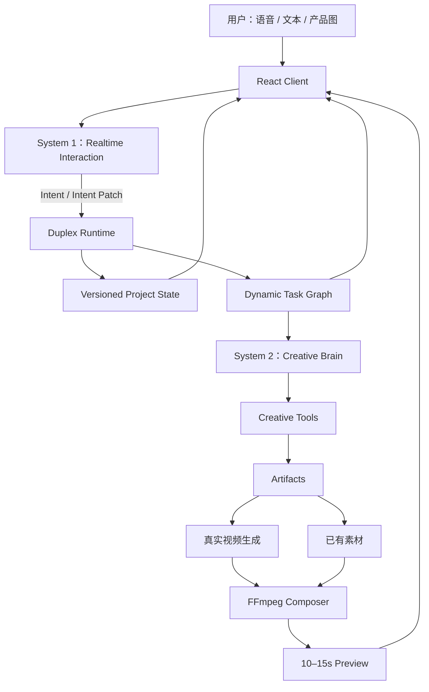
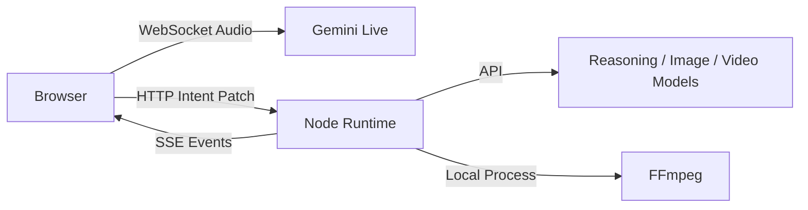

# Duplex Studio：面向实时创作 Agent 的工程设计方案

> 版本：Design Spec v1.0  
> 日期：2026-10-04  
> 目标：在 2–3 天内完成一个可在面试现场真实运行、可联网调用外部模型、能够真实生成视频的 Omni-Duplex Creative Agent Demo。

## 1. 项目定位

Duplex Studio 不是一个“语音控制的视频生成器”，也不是把旧工作流重新包装成多个 Agent。它要验证的是一个更具体的问题：当用户与创作 Agent 持续交互，而后台同时存在脚本、素材、图像/视频生成和渲染任务时，系统如何允许用户随时打断、修改意图，并让后台只重做真正受影响的工作，同时保证旧任务的异步结果不会污染最新创作状态。

一句话定义：

> 用户可以在 AI 正在创作短视频的过程中随时讲话、打断和修改需求；前台实时 Agent 立即理解变化并反馈，后台 Creative Agent 根据最新 Project State 动态复用、取消和重规划任务，真实调用视频生成模型生成动态镜头，最终持续产出更新后的短视频。

这个 Demo 是 2025 年快手广告生成 Workflow 的一次架构升级。旧系统的核心是“输入一次 → Workflow 顺序/分支执行 → 输出结果”；新系统的核心是“持续交互 → 状态不断变化 → 后台任务并行执行 → 局部重规划 → Artifact 持续更新”。

## 2. 成功标准

现场 Demo 必须真实证明以下能力：

1. 用户可以通过语音与 Agent 低延迟连续对话。
2. Agent 说话或后台执行任务时，用户可以直接插话，不需要先点击 Stop。
3. 用户修改需求后，系统形成结构化 Intent Patch，并生成新的 Project State Version。
4. 后台已有任务不会全部重新开始，而是根据依赖关系执行 Keep / Reuse / Cancel / Replan。
5. 旧版本异步任务即使晚返回，也不会写入最新状态。
6. System 2 可以在后台并行生成脚本、分镜、检索素材以及调用生成工具。
7. 至少一个 AI Scene 必须真实调用视频生成 API 获得动态 mp4，不以静态图 Ken Burns 动画冒充“生成视频”。
8. 最终 10–15 秒 Preview 由真实素材和/或 AI 生成视频片段经过 FFmpeg 真正合成。
9. Timeline 和延迟指标来自真实 Event Log，不使用写死的演示数字。
10. 网络或某一生成 API 异常时，Demo 可以降级但不会整体中断，并明确显示已进入 Fallback。

建议的体验目标，而非硬编码承诺：首次语音响应尽量小于 1.5 秒；打断反馈尽量小于 500 ms；Intent Patch 提交后本地 Task Graph 重规划尽量小于 1 秒。视频生成耗时单独展示，不要求伪装成实时完成。

## 3. 总体架构

系统采用“Dual-System Agent + Deterministic Runtime + Tools”的混合架构，而不是 Multi-Agent Swarm。



### 3.1 System 1：Realtime Interaction Agent

System 1 负责实时交互，而不负责复杂内容生产：

- 接收麦克风实时音频；
- VAD 与 turn detection；
- Barge-in；
- 快速口头确认；
- 识别用户当前意图与意图变化；
- 通过强类型 Function Tool 提交 Intent / Intent Patch；
- 消费 Runtime Event，决定是否向用户主动播报进度。

默认实现采用 Gemini 3.8 Live。浏览器通过后端签发的短期 ephemeral token 直连 Live API，避免把长期 API Key 暴露在客户端，同时减少 Browser → Backend → Model 的额外音频转发延迟。

由于 Live 模型不依赖自由文本 JSON 来驱动状态，System 1 注册明确的 Tool：

```ts
applyIntentPatch({
  baseVersion,
  changes,
  userSummary
})
```

Function Tool 执行后把 Patch 发送给 Duplex Runtime；对话本身可以继续。

### 3.2 System 2：Creative Brain

第一版只保留一个后台 Creative Brain，不拆出 Script Agent、Asset Agent、Storyboard Agent 等多个自治 Agent。

System 2 的循环为：

```text
Observe Project State
        ↓
Plan / Replan
        ↓
Propose Tool Tasks
        ↓
Runtime Execute
        ↓
Observe Artifacts / Tool Results
        ↓
Finish or Repair
```

System 2 可以使用 Gemini 3.1 Pro Preview 作为默认 Reasoning Provider，并通过统一接口隔离模型供应商：

```ts
interface ReasoningProvider {
  plan(state: ProjectState, context: PlannerContext): Promise<CreativePlan>
}
```

后续换 OpenAI、Claude、豆包或其他模型时不修改 Runtime。

### 3.3 Duplex Runtime

Runtime 是本项目真正的工程核心，由确定性代码实现：

- Project State Manager；
- Task Graph；
- Dependency Resolver；
- Parallel Scheduler；
- Cancellation Manager；
- Stale Result Guard；
- Event Log；
- Artifact Registry。

原则是：模型负责 Intelligence，Runtime 负责 Consistency。

## 4. Versioned Project State

聊天记录不是项目的唯一状态。系统维护显式 Project State：

```ts
interface ProjectState {
  version: number

  brief: {
    product: string
    audience: string
    platform: string
    duration: number
  }

  creative: {
    sellingPoint: string
    style: string
    tone: string
  }

  script?: Script
  scenes: Scene[]
  assets: Asset[]
  generatedClips: VideoArtifact[]
  preview?: VideoArtifact
}
```

用户第一次提出任务产生 State v1。之后任何具有任务意义的修改都通过 Intent Patch 更新状态，而不是把整个 Prompt 重新生成一遍。

示例：

```json
{
  "patch_id": "patch_02",
  "base_version": 1,
  "changes": {
    "creative.sellingPoint": "low_sugar",
    "creative.style": "campus_vlog"
  },
  "user_summary": "不强调提神，突出低糖，并降低广告感"
}
```

Runtime 校验 `base_version` 后提交 v2，并产生 `STATE_UPDATED` Event。

## 5. Dynamic Task Graph

每个后台任务都带输入版本和依赖字段：

```ts
interface TaskRecord {
  id: string
  type: TaskType
  stateVersion: number
  dependencies: string[]
  affectedBy: string[]
  status:
    | "pending"
    | "running"
    | "completed"
    | "cancelled"
    | "stale"
    | "failed"
  startedAt?: number
  finishedAt?: number
  artifactIds?: string[]
}
```

依赖规则第一版使用确定性映射，而不是每次让另一个 LLM 判断：

| State 字段变化 | 主要受影响任务 |
| --- | --- |
| product | product analysis、strategy、script、asset、storyboard、generation、render |
| audience | strategy、script、asset、storyboard、generation、render |
| sellingPoint | script、storyboard、generation、render |
| style / tone | asset、storyboard、generation、render |
| platform | script、aspect ratio、storyboard、render |
| duration | script、storyboard、clip duration、render |
| scene_N.source | 指定 Scene 的 asset/generation + render |

因此自然语言的“语义”由 System 1 转成结构化 Patch，Runtime 再依据 Patch 做确定性 Semantic Task Invalidation。

典型结果：

```text
REUSE      product_analysis
REUSE      product_reference_asset
UPDATE     asset_search
CANCEL     script_v1
CANCEL     storyboard_v1
CANCEL     generated_scene_2_v1
CREATE     script_v2
CREATE     storyboard_v2
CREATE     generated_scene_2_v2
```

如果 Patch 命中了 Runtime 尚未认识的字段，采用保守策略：保留无关的产品基础分析，失效所有下游 Creative Artifacts，避免错误复用。

## 6. Cancellation 与 Stale Result Guard

Runtime 对可取消任务使用 `AbortController` 做 best-effort cancellation，但不能假设外部模型请求一定能被真正撤销。

每个 Tool Result 返回时都先执行版本校验：

```ts
if (result.stateVersion !== currentState.version) {
  markTaskAsStale(result.taskId)
  emit("STALE_RESULT_DROPPED")
  return
}
```

只有当前 State Version 对应的结果才允许注册为 Active Artifact。

为了让面试现场稳定展示这一问题，Demo 中允许给某一个真实远程任务注入可配置 artificial latency。真实 API 调用仍然发生，只是测试层延迟 Result Commit，从而稳定复现：v1 请求执行 → 用户修改为 v2 → v1 晚返回 → Stale Guard 丢弃。面试时明确说明这是用于可复现 race condition 的故障注入。

## 7. Creative Tools

P0 Tools 固定为：

```text
analyze_product()
generate_script()
generate_storyboard()
search_assets()
generate_image_reference()
generate_video()
render_preview()
```

P1 才增加：

```text
evaluate_result()
repair_scene()
```

Tool 与 Agent 分离。Tool 做确定动作，Agent 做需要上下文判断的规划和选择。

## 8. 真实视频生成管线

真实视频生成是正式 P0 能力，不是 Optional。

### 8.1 Scene Router

Storyboard 为每个 Scene 指定来源策略：

```ts
type SceneSource =
  | "generated_video"
  | "existing_asset"

interface Scene {
  id: string
  durationSec: number
  narration?: string
  visualDescription: string
  source: SceneSource
  generationPrompt?: string
  assetQuery?: string
}
```

默认 Golden Path 使用 4 个 Scene，其中 1–2 个走 `generated_video`，其余走已有真实素材。用户可以在创作过程中说“第三镜头不要生成，换成真实产品素材”，触发 Scene-level routing change。

### 8.2 VideoProvider

视频模型通过 Adapter 隔离：

```ts
interface VideoProvider {
  submit(input: VideoGenerationInput): Promise<GenerationJob>
  poll(jobId: string): Promise<GenerationStatus>
  cancel?(jobId: string): Promise<void>
  fetch(jobId: string): Promise<VideoArtifact>
}
```

默认优先接 Gemini API 当前的视频生成能力；Google 官方当前建议一般视频生成工作流默认使用 Gemini Omni Flash，需要视频扩展、特定帧控制或传统管线能力时可使用 Veo 3.1。Provider 层保留对 Seedance/Kling 等 API 的替换能力。

视频任务使用异步 Job，不阻塞 System 1。Runtime 在轮询时持续产生：

```text
VIDEO_JOB_SUBMITTED
VIDEO_JOB_PROGRESS
VIDEO_JOB_COMPLETED
VIDEO_JOB_STALE
```

### 8.3 Final Composition

AI 生成视频与已有素材都转为统一 ClipArtifact，最后由 FFmpeg：

- trim 到 Scene duration；
- 统一 9:16 尺寸；
- crop/scale；
- 简单转场；
- 烧录字幕/卖点；
- 可选背景音乐；
- 合成为 10–15 秒 `preview_vN.mp4`。

最终 Preview 必须包含至少一个真实生成的动态片段。Golden Path 不要求所有 Scene 都由视频模型生成，以控制现场等待时间和失败面。

## 9. Asset Search

第一版不建设复杂 RAG 或独立向量数据库。Demo 自带一个小型素材库：

```text
demo/assets/
  product/
  campus/
  dorm/
  lifestyle/
```

每个素材有轻量 metadata：

```json
{
  "id": "asset_021",
  "tags": ["campus", "young", "lifestyle", "coffee"],
  "type": "video"
}
```

P0 使用标签过滤 + 文本相似度即可。过去快手项目里的客户素材知识库/RAG 可以作为设计来源讲述，但本项目不让 RAG 抢占 Duplex Runtime 的开发时间。

## 10. 前端信息架构

Demo 只有一个核心页面，不做登录、项目列表、后台管理。

```text
┌──────────────────────────────────────────────────────┐
│ DUPLEX STUDIO                ● LIVE       State v2  │
├────────────┬─────────────────────────┬───────────────┤
│ REALTIME   │ CREATIVE CANVAS         │ AGENT BRAIN   │
│            │                         │               │
│ Listening  │ Scene 1   Scene 2       │ ✓ Product     │
│            │                         │ ↻ Assets      │
│ You: ...   │ Scene 3   Scene 4       │ × Script v1   │
│ Agent: ... │                         │ ● Script v2   │
│            │ [Final Preview ▶]       │ ● Video Gen   │
├────────────┴─────────────────────────┴───────────────┤
│ TIMELINE                                             │
│ INTERRUPT → PATCH → CANCEL → REUSE → REPLAN → VIDEO │
├──────────────────────────────────────────────────────┤
│ Response 620ms | Interrupt 180ms | Replan 430ms     │
└──────────────────────────────────────────────────────┘
```

视觉方向是“Creative IDE + Agent Observatory”，而不是传统聊天机器人。

### Realtime Panel

显示用户/Agent 转写、Listening/Speaking/Interrupted 状态和麦克风状态。

### Creative Canvas

显示 Creative Brief、4 个 Scene Card、每个 Scene 的 Source、生成状态、缩略预览和最终视频播放器。

### Agent Brain

显示 State Version、后台任务、并行状态以及 Keep / Reuse / Cancel / Replan / Stale。

### Timeline + Metrics

直接消费 Event Log，用于产品展示、Debug 和研究评估。

## 11. Event Model 与指标

Runtime 统一记录至少这些 Event：

```text
USER_SPEECH_START
USER_SPEECH_END
AGENT_RESPONSE_START
AGENT_INTERRUPTED
INTENT_PATCH_COMMITTED
STATE_UPDATED
TASK_STARTED
TASK_REUSED
TASK_CANCELLED
TASK_COMPLETED
STALE_RESULT_DROPPED
VIDEO_JOB_SUBMITTED
VIDEO_JOB_COMPLETED
PREVIEW_READY
```

四个核心指标全部实时计算：

1. `First Response = AGENT_RESPONSE_START - USER_SPEECH_END`
2. `Interrupt Reaction = AGENT_INTERRUPTED - USER_SPEECH_START`
3. `Replan Latency = NEW_TASK_GRAPH_STARTED - INTENT_PATCH_COMMITTED`
4. `Task Reuse = ReusedTasks / ExistingTasksAtPatch`

视频生成额外展示：

5. `Video Generation Latency`
6. `End-to-End Preview Time`

## 12. 通信设计



- Browser ↔ Gemini Live：实时音频 WebSocket。
- Backend → Browser：签发短期 ephemeral token。
- Browser → Runtime：HTTP 提交 Intent Patch 和 Demo 控制命令。
- Runtime → Browser：SSE 推送 State、Task、Artifact 和 Event。
- Runtime → 外部模型：服务端 API 调用，长期密钥不进入浏览器。

除实时音频外不再引入第二套自建 WebSocket，以降低 3 天 Demo 的通信复杂度。

## 13. 技术栈

| 层 | 第一版选择 |
| --- | --- |
| Language | TypeScript |
| Frontend | React + Vite |
| UI | Tailwind 或轻量 CSS |
| Realtime System 1 | Gemini 3.8 Live |
| System 2 | Gemini 3.1 Pro Preview，经 Provider Adapter |
| Schema | Zod |
| Backend | Node.js + Express |
| Push | Server-Sent Events |
| Runtime | 自研 lightweight runtime |
| Concurrency | Promise + AbortController |
| State | In-memory authoritative state |
| Trace | JSONL Event Log |
| Assets | Local demo asset library |
| Image | Gemini image provider，可替换 |
| Video | Gemini Omni Flash / Veo provider，可替换 Seedance/Kling |
| Composition | FFmpeg |
| Deployment | 面试机 localhost，不依赖云部署 |

## 14. 建议代码结构

```text
duplex-studio/
  apps/
    web/
      src/
        components/
          RealtimePanel/
          CreativeCanvas/
          AgentBrain/
          Timeline/
          Metrics/
        realtime/
          geminiLive.ts
        state/
          uiStore.ts

    server/
      src/
        runtime/
          projectState.ts
          taskGraph.ts
          invalidation.ts
          scheduler.ts
          staleGuard.ts
          eventLog.ts
          artifactRegistry.ts
        agents/
          creativeBrain.ts
        tools/
          analyzeProduct.ts
          generateScript.ts
          generateStoryboard.ts
          searchAssets.ts
          generateImageReference.ts
          generateVideo.ts
          renderPreview.ts
        providers/
          reasoningProvider.ts
          videoProvider.ts
          imageProvider.ts
        routes/
          session.ts
          intent.ts
          events.ts
          demo.ts

  packages/
    shared/
      schemas/
      types/

  demo/
    assets/
    product/
    fallback/
    fixtures/

  traces/
```

## 15. P0 / P1 / 不做

### P0：必须真实完成

- Realtime Voice；
- Barge-in；
- Function Tool Intent Patch；
- Versioned Project State；
- Dynamic Task Graph；
- Keep / Reuse / Cancel / Replan；
- Parallel task execution；
- Stale Result Guard；
- Creative Brain；
- Script generation；
- Storyboard generation；
- Local asset retrieval；
- 至少一个 Scene 的真实 AI 视频生成；
- AIGC + Existing Asset 混合路由；
- FFmpeg 真实生成最终 mp4；
- Event Timeline；
- Real Metrics；
- Reset；
- Fallback / Replay。

### P1：P0 稳定后再加入

- Multimodal Critic；
- 自动 Repair Scene；
- 用户上传任意产品图；
- 多视频供应商切换；
- 所有 AI Scene 全量实时生成；
- Trace 导出和研究报告页。

### 本 Demo 明确不做

- 训练 Omni-Duplex 基座模型；
- 5–10 个 Sub-agent 的 Swarm；
- LangGraph / Temporal / Celery 等重型编排基础设施；
- 完整商业素材 RAG；
- 大型向量数据库；
- 登录、用户系统、项目管理后台；
- 云端生产部署；
- 数字人；
- 复杂剪辑器；
- 把所有镜头都强制交给长耗时视频模型。

## 16. Golden Path

现场只演三次核心交互。

### Turn 1：创建

用户：

> 帮我给这款气泡咖啡做一个 15 秒抖音广告，目标用户是大学生，轻松一点，不要太商业。

System 1 在低延迟下确认；Runtime 创建 State v1；System 2 开始 product analysis / script / asset planning；Canvas 开始出现 Scene；需要的 AI Scene 提交真实视频生成任务。

### Turn 2：中途打断

在后台仍有任务运行时，用户直接插话：

> 等等，不要强调提神，重点突出低糖，而且整体别像广告，像大学生真实生活记录。

System 1 被打断并快速确认；提交 Patch；State v1 → v2；Runtime 复用 Product Analysis，更新 Asset Search，取消 v1 Script / Storyboard / affected Video Jobs，创建 v2 任务。一个人为注入延迟的 v1 Result 随后返回，UI 展示 `STALE — DROPPED`。

### Turn 3：Scene-level 修改

用户：

> 第三个镜头别生成了，换成真实产品素材。

只让 Scene 3 的 source 从 `generated_video` 变为 `existing_asset`；Scene 1/2/4 保留；Scene 3 视频生成任务取消或在返回时判 stale；重新渲染最终 Preview。

最终播放 10–15 秒真实 mp4，其中至少包含一个由视频生成模型实时产出的动态片段。

## 17. Fallback 与现场可靠性

系统提供三种模式：

### LIVE

所有可用模型和工具都真实调用。面试默认使用。

### HYBRID

Realtime Interaction 和 Runtime 仍然真实工作；如果视频/图像生成 API 超时或失败，允许使用本次演练前缓存的 Artifact 继续合成。UI 明确显示 `Fallback Artifact`，不伪装成当前实时生成。

### REPLAY

播放之前保存的 `trace.jsonl` 和关联 Artifacts，完整复现 State / Task / Timeline / Preview。只作为网络完全不可用时的最后保底。

面试前另保存一段 2 分钟完整 Demo 录屏。

外部调用必须设置 timeout；单一视频 Scene 失败不能让整个 Task Graph 失败。失败时 Artifact Registry 标记失败原因，Runtime 决定重试一次或进入明确的 fallback。

## 18. 三天开发边界

### Day 1：Realtime + State

- 搭 React 页面与四区 UI Skeleton；
- Gemini Live 语音往返；
- Barge-in；
- `applyIntentPatch()`；
- Project State v1 → v2；
- Event Log；
- 前端实时显示 State Diff。

Day 1 验收：即使还没有视频，也可以通过真实语音创建需求并打断修改，状态正确更新。

### Day 2：Runtime + Creative + Video

- Task Graph；
- Dependency Map；
- Parallel Scheduler；
- AbortController；
- Stale Result Guard；
- Creative Brain；
- Script / Storyboard；
- Local Asset Search；
- 接通 `VideoProvider`，至少成功生成一个真实动态 Clip；
- FFmpeg 输出第一条 10–15 秒 Preview。

Day 2 验收：完整 Golden Path 可以从第一次语音走到最终视频。

### Day 3：Reliability + Presentation

- Timeline；
- Metrics；
- Task 动画；
- State Diff；
- API timeout；
- Retry；
- Hybrid Fallback；
- Replay；
- Reset Demo；
- 保存一条稳定 Golden Trace；
- 连续跑至少 10 次，修复高频失败点；
- 录制 Backup Demo Video。

Day 3 原则：P0 未达到稳定前不新增 P1 功能。

如果只有两天，优先砍 Critic、复杂 Image Generation、向量检索和额外视觉动效，但不砍 Realtime、Intent Patch、Versioned State、Replanning、Stale Guard 和至少一次真实 Video Generation。

## 19. 测试与验证

### Runtime 单元测试

至少覆盖：

1. `sellingPoint` 改变时正确失效 Script/Storyboard/相关 Scene；
2. `scene_3.source` 改变时只重规划 Scene 3 和 Render；
3. v1 Result 在 v2 激活后返回时无法写入 Artifact Registry；
4. 任务取消失败但晚返回时仍然被 Stale Guard 捕获；
5. 一个 Tool failed 不会破坏整个 Event Stream；
6. Reset 后没有旧任务继续写入新 Session。

### Golden Path 集成测试

使用固定 Fixtures 对三次 Turn 做自动/半自动回放，验证 Event 顺序和最终 State，不依赖每次都重新消耗视频生成额度。

### 面试前 Smoke Test

- API Key 有效；
- 麦克风权限；
- Gemini Live 可连接；
- Video Provider 可提交并取回 mp4；
- FFmpeg 存在；
- Demo Assets 存在；
- Fallback Artifacts 存在；
- LIVE → HYBRID → REPLAY 均能运行；
- Reset 可恢复初始状态。

## 20. 研究表达

这个 Demo 对应四个可以直接向面试官讲的研究问题：

**RQ1：** 用户实时修改意图时，如何低延迟同步前台交互与后台创作？

**RQ2：** 如何识别意图修改影响的最小任务集合，从而减少不必要的推理和生成？

**RQ3：** 在异步、并行、不可完全取消的外部 Tool 环境中，如何避免旧任务结果污染最新状态？

**RQ4：** 除 Task Success 外，如何度量实时创作 Agent 的 interruption latency、replan latency、reuse efficiency 和 end-to-end artifact latency？

面试时项目的核心总结应为：

> 这不是简单把 Workflow 换成 Agent。我关注的是 continuous interaction 下的 Agent execution consistency：System 1 保持实时用户交互，System 2 做后台复杂创作，Versioned State 和 Dynamic Task Graph 把两者连接起来；用户意图变化时只失效相关任务，Stale Result Guard 保证旧的异步生成结果不会覆盖最新创作状态。同时，最终 Artifact 包含真实视频生成模型输出，而不是只停留在规划层。

## 21. 最终交付物

项目完成时准备五项面试材料：

1. 可现场运行的 Duplex Studio Demo；
2. 2 分钟 Backup Demo Video；
3. 一张 Architecture Diagram；
4. 一页 `2025 Static Workflow → 2026 Duplex Agent` Before/After；
5. 一页 Research Questions + 实测 Metrics。

## 22. 当前官方能力依据

- Gemini Live API：https://ai.google.dev/gemini-api/docs/live-api
- Gemini 3.8 Live：https://ai.google.dev/gemini-api/docs/models/gemini-3.8-live
- Live API Ephemeral Tokens：https://ai.google.dev/gemini-api/docs/live-api/ephemeral-tokens
- Live API Tool Use：https://ai.google.dev/gemini-api/docs/live-api/tools
- Gemini 3.1 Pro Preview：https://ai.google.dev/gemini-api/docs/models/gemini-3.1-pro-preview
- Gemini API Video Generation：https://ai.google.dev/gemini-api/docs/video

模型名称与 Preview 状态属于可替换的 Provider 配置；项目架构不依赖某一个固定模型版本。

